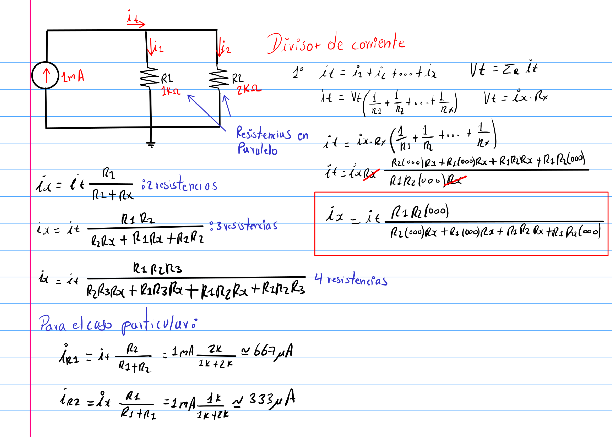
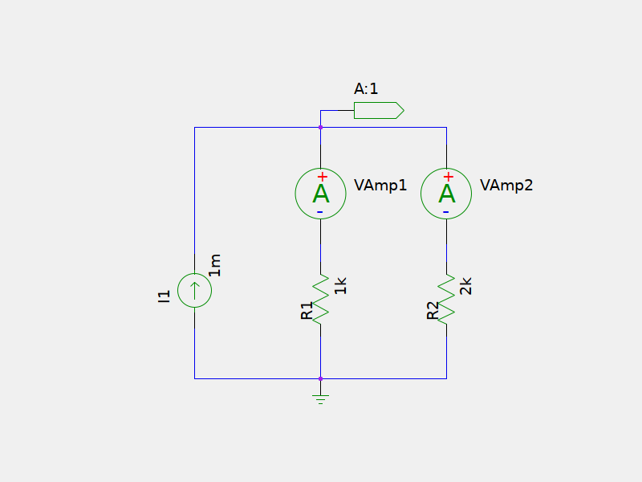
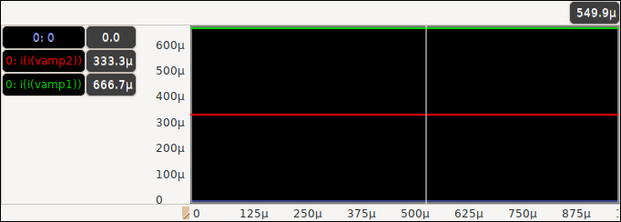

# Divisor de corriente

## Análisis

## Esquema

## Simulación

Como se puede apreciar en el esquema de la simulación se han agregado dos Vamp;
los Vamp son fuentes de tensión de **0V** que se agregan con el fin de poder
medir la corriente que circulan en ellas son aportar nada al circuito. Se pude
considerar como una especie de artilugio para lograr los resultados de la simulación.

* En la simulación **i(i(vamp1))** corresponde a la corriente que atraviesa la resistencia **R1**
* En la simulación **i(i(vamp2))** corresponde a la corriente que atraviesa la resistencia **R2**

## Archivos fuentes

Descarga los archivos fuente desde
[AQUÍ](./current-divider.zip)

Ejecuta los siguientes comando en la terminal para ver los resultados
con los archivos fuentes.

* `unzip current-divider.zip` descomprimir archivos fuente
* `cd current-divider/` entra al directorio del proyecto
* `make ss`: Editar esquemático
* `make n`: Generar netlist
* `make s s=sim/tran.ngsim`: simulación transitoria
* `gwave out/tran.raw`: ver resultado de simulación

También puede hacer uso de **gaw** en vez de gwave.

### Observaciones

1. Para salir de la simulación de ngspice oprima `ctrl + d`
