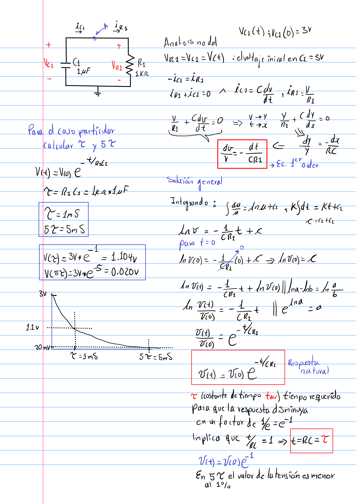
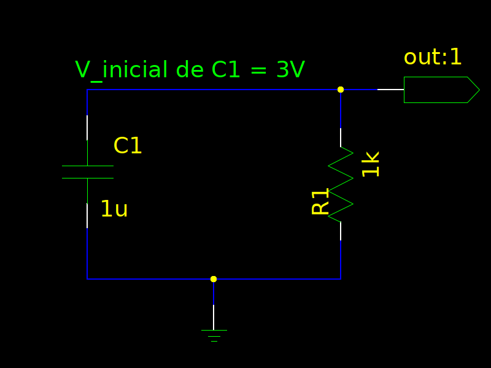
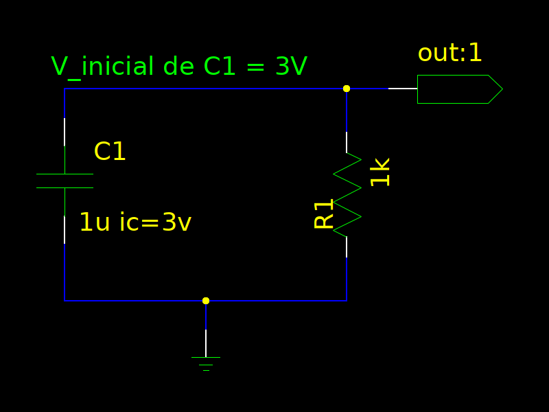
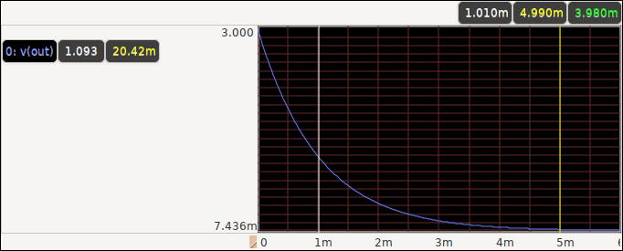

# Ciruito RC sin fuente

En este ejemplo desarrollaremos el análisis y la simulación de un circuito que consta
de una resistencia y un condensador, suponemos que el condensador está inicialmente cargado
y además no hay una fuente de alimentación, lo cual conlleva a que el condensador se descargue
en el tiempo. Presentaremos también dos maneras para simular la **Condición inicial** en el
condensador las cual las llamaremos opción 1 y opción 2.

## Análisis



## Esquema

Tendremos como se mencionó la posibilidad de obtener el
mismo resultado de simulación por dos opciones distintas.

### Opción 1

En esta opción no se indicará el valor de la condición inicial
en el esquema sino directamente en las opciones de simulación.



El netlist generado no indicará la condición inicial:

```bash
C1 out 0 1u
R1 0 out 1k
```

### Opción 2

La condición inicial es señalada como parte del valor en el condensador



El netlist generado indicará la condición inicial:

```bash
C1 out 0 1u ic=3v
R1 0 out 1k
```

## Simulación

Como se dijo, ambas simulación generarán el mismo resultado el cual
se puede ver en la siguiente imagen, el cursor blanco indica el valor en **tau**,
mientras que el cursor amarillo muestra el valor de **5tau**.



Para simular opción 1 (condiciones iniciales puestas en las opciones de la simulación)
puede ejecutar los siguientes comandos:

```bash
make PRJ=rc-circuit-without-source-1 n s s=sim/tran1.ngsim
gaw out/tran1.raw
```

Para simular opción 2 (condiciones iniciales puestas puestas en el valor del condensador)
puede ejecutar los siguientes comandos:

```bash
make PRJ=rc-circuit-without-source-2 n s s=sim/tran2.ngsim
gaw out/tran2.raw
```

**Observación**: desde mi punto de vista es mejor escoger la opción 1 ya que es más limpio
en el proceso de crear el esquema.

## Archivos fuentes

Descarga los archivos fuente desde
[AQUÍ](./rc-circuit-without-source-1.zip)

Ejecuta los siguientes comando en la terminal para ver los resultados
con los archivos fuentes.

* `unzip rc-circuit-without-source-1.zip` descomprimir archivos fuente
* `cd rc-circuit-without-source-1/` entra al directorio del proyecto
* `make ss`: Editar esquemático
* `make n`: Generar netlist
* `make h`: ver ayudas sobre los demás comandos


### Observaciones

1. Para salir de la simulación de ngspice oprima `ctrl + d`
