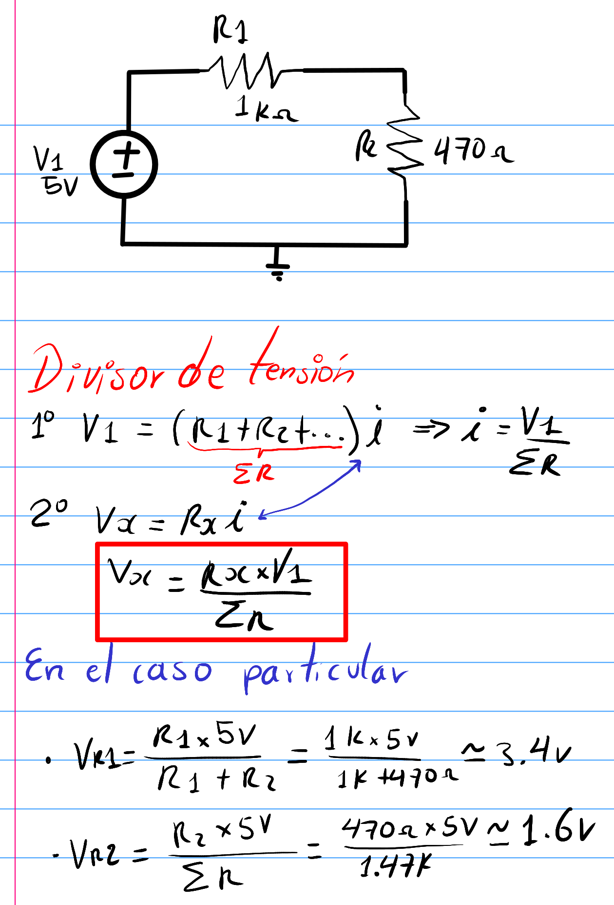
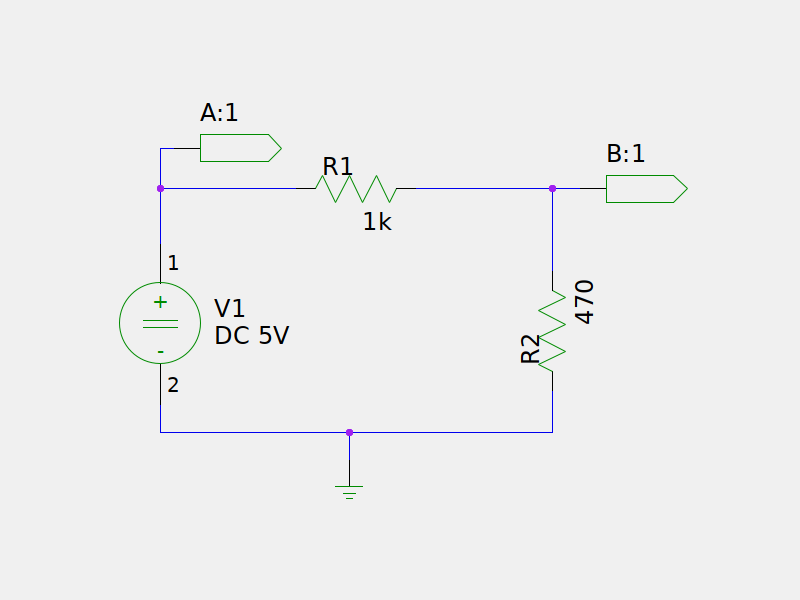
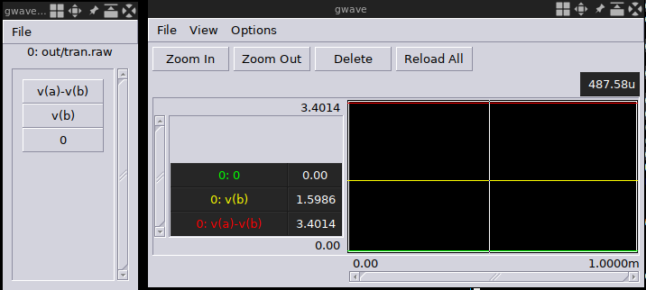

# Divisor de voltaje

## Análisis

## Esquema

## Simulación

* En la simulación se han etiquetado dos nodos como nodo **A** y nodo **B**
* El voltaje **VR1** es el voltaje etiquetado en la simulación como **v(a)-v(b)**
* El voltaje **VR2** es el voltaje etiquetado en la simulación como **v(b)**.

## Archivos fuentes

Descarga los archivos fuente desde
[AQUÍ](./voltage-divider.zip)

Ejecuta los siguientes comando en la terminal para ver los resultados
con los archivos fuentes.

* `unzip voltage-divider.zip` descomprimir archivos fuente
* `make ss`: Editar esquemático
* `make n`: Generar netlist
* `make s s=sim/tran.ngsim`: simulación transitoria
* `gwave out/tran.raw`: ver resultado de simulación

### Observaciones

1. Para salir de la simulación de ngspice oprima `ctrl + d`
